# Hi, I'm Hollins Yu 👋

I'm a software engineer interested in systems programming, databases, and machine learning.
Currently exploring database internals through CMU 15-445 and deep learning through robotics and imitation learning.

## 🔧 What I'm Working On

- 🗄️ **[CMU 15-445 BusTub](https://15445.courses.cs.cmu.edu/)** — Building a relational database from scratch, covering buffer pool management, B+ trees, query execution, concurrency control, and query optimization.

- 🤖 **[DASC7606C ManiSkill Diffusion Policy](https://github.com/hryang1130/7606C)** — Working on a six-task RGB-based robotic manipulation project using ManiSkill and Diffusion Policy. I maintain the project's [expert demonstration generation pipeline](https://github.com/hollinsStuart/maniskill-demogen) and [unified training/evaluation pipeline](https://github.com/hollinsStuart/dp-manip), including multi-GPU experiment orchestration, checkpoint/resume, automated evaluation, and controlled studies on dataset size and model architecture.

- 📈 **[TradingAgents](https://github.com/TauricResearch/TradingAgents)** — Contributing to a multi-agent LLM financial trading framework built on LangGraph, where analyst, researcher, trader, and risk-management agents collaborate and debate to reach trading decisions.

## 🛠️ Tech Stack

## 📚 Currently Learning

- Database internals — query optimization, transaction processing, and parallel query execution
- Deep learning — diffusion models, imitation learning, and visuomotor policies
- Robotic manipulation with ManiSkill
- Algorithm problem solving in Go
- To make latte art

## 📬 Connect

- 🌐 [hollinsyu.com](https://hollinsyu.com)

---

